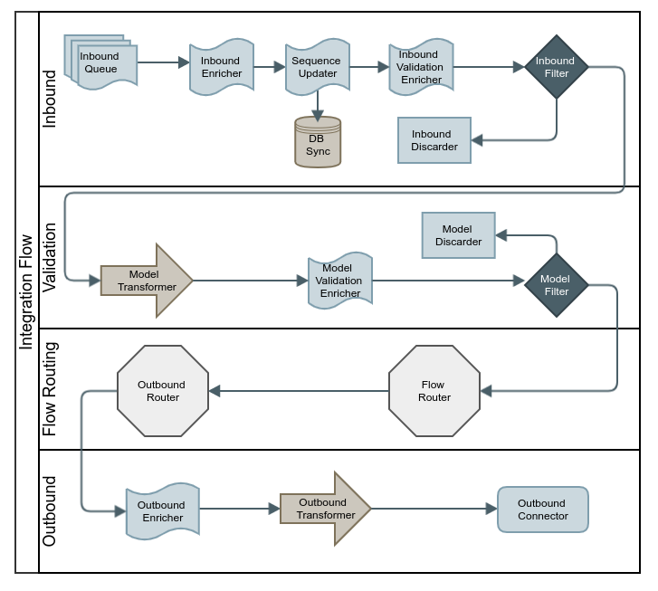

# Spring Charon
## Data Sync between two applications using Spring Integration

## 
* **Inbound Queue**: Connection to 

-- Ack only on delivery success

## Release Notes

* **2019-12-27**: First version, all working just fine, but documentation :smile: 

# Study Case

## The Scenario

* Flow
(jmsPurchaseInboundChannel) -> jmsPurchaseFilterChannel
jmsPurchaseFilterChannel -> modelTransformerChannel / jmsPurchaseDiscardEnricherChannel
modelTransformerChannel -> modelEnricherChannel
modelEnricherChannel -> modelFilterChannel
modelFilterChannel -> modelRouterChannel / modelDiscardChannel
modelRouterChannel ==> purchaseSequenceChannel
purchaseSequenceChannel -> purchaseRouterChannel / purchaseReorderChannel
purchaseRouterChannel ==> purchaseOutboundEnricherChannel
purchaseOutboundEnricherChannel -> kafkaTransformerChannel
kafkaTransformerChannel -> (kafkaOutboundChannel)

## References

* https://better-coding.com/building-apache-kafka-cluster-using-docker-compose-and-virtualbox/
* https://spring.io/guides/gs/rest-service/
* https://github.com/edenhill/kafkacat
* https://www.baeldung.com/spring-kafka
* https://docs.spring.io/spring-kafka/reference/html/#kafka
* https://dzone.com/articles/20-best-practices-for-working-with-apache-kafka-at
* http://dev.splunk.com/view/splunk-logging-java/SP-CAAAE3R
* https://github.com/simplesteph/kafka-stack-docker-compose
* https://www.confluent.io/blog/schema-registry-avro-in-spring-boot-application-tutorial
* https://msayag.github.io/Kafka/
* https://memorynotfound.com/spring-kafka-adding-custom-header-kafka-message-example/
* https://developer.ibm.com/tutorials/mq-jms-application-development-with-spring-boot/
* https://objectpartners.com/2018/08/21/testing-with-spring-kafka-and-mockschemaregistryclient/
* https://memorynotfound.com/spring-boot-embedded-activemq-configuration-example/

* https://medium.com/@felipedutratine/kafka-ordering-guarantees-99320db8f87f
* https://github.com/christian-posta/spring-integration-samples
* https://dzone.com/articles/message-processing-spring

## Backlog
* Make activemq files writable at target folder
